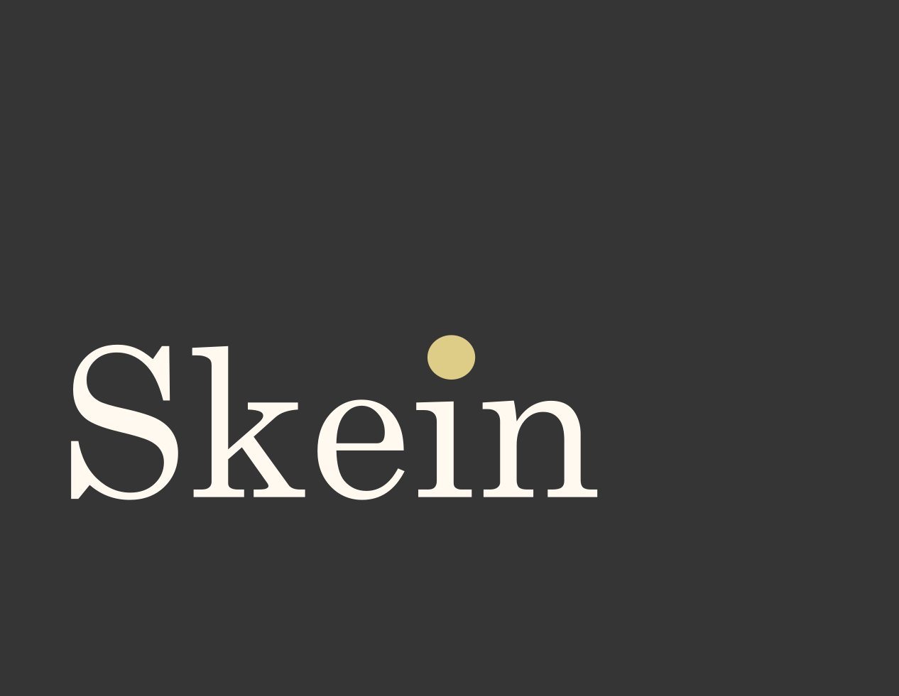
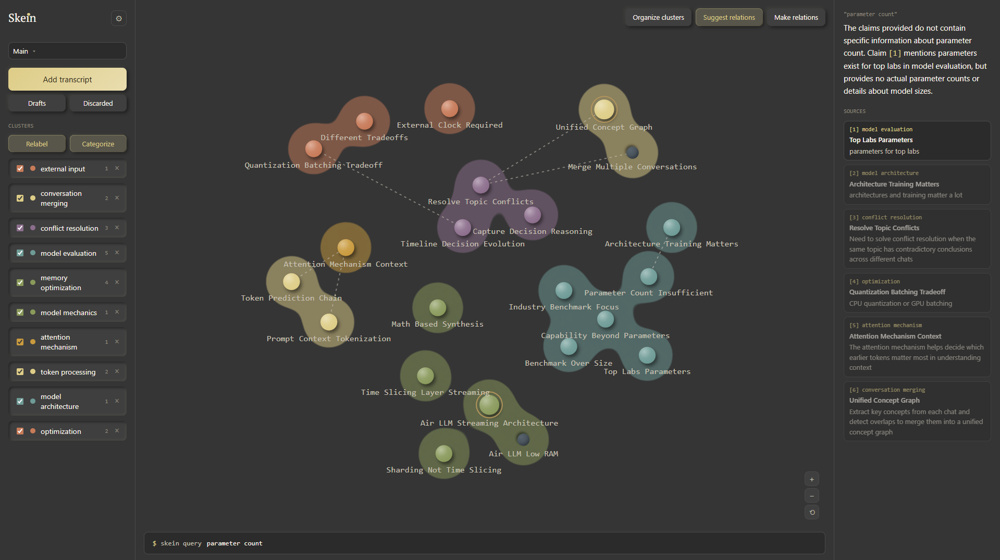

<p align="center">
  
</p>

<p align="center">
  <a href="https://github.com/Virerra/Skein/actions/workflows/deploy.yml"></a>
  <a href="https://virerra.github.io/Skein/"></a>
  <a href="LICENSE"></a>
</p>

A personal knowledge graph: paste chat transcripts, extract atomic
claims, and let contradictory claims chain into correction history
instead of overwriting each other. The graph — not the raw
transcripts — is what a real RAG query answers from.

**[Live demo →](https://virerra.github.io/Skein/)**



Real embedding-based retrieval and LLM synthesis, topic-clustered graph
with AI-assisted and manual cross-topic relations, bulk re-categorization,
and a separate CLI (`cli/`) for the same extract → categorize → query
pipeline with no browser involved. Several pieces are still naive on
purpose, deliberately — see "What's naive on purpose" below.

## Running it

```bash
npm install
npm run dev
```

Open Settings (gear icon) to configure a model provider before your
first extraction — see "Model providers" below. Then use "Add
transcript" to paste a chat transcript and extract claims from it.

## What's here

- `src/lib/db.js` — IndexedDB storage. One `claims` object store.
- `src/lib/extraction.js` — dispatcher that routes to whichever
  provider is configured in Settings; shares one claim-shaping step
  (id/timestamp/status) across all of them.
- `src/lib/providers/` — `anthropic.js`, `openaiCompatible.js` (also
  covers local models), `webllm.js` (experimental). See "Model
  providers" below.
- `src/lib/settings.js` — localStorage-backed provider/model/theme
  settings. The API key itself is never stored here — see "Model
  providers".
- `src/lib/graphModel.js` — conflict detection + chain building.
- `src/lib/query.js` — real retrieval (embedding similarity) +
  synthesis. See "Query / RAG" below.
- `src/lib/providers/embed.js` — local embeddings via WebLLM, decoupled
  from chat provider.
- `src/lib/categorize.js`, `src/lib/relate.js` — bulk topic
  re-labeling and cross-topic relation suggestions, both LLM-driven.
- `src/lib/topicColor.js` — deterministic, collision-checked topic →
  hue assignment; theme-aware (see "Visual identity").
- `src/components/` — app-specific UI: `IngestPanel`/`TranscriptEditor`
  (ingest modal), `DraftsModal` (saved transcript drafts),
  `SettingsPanel` (provider + theme config), `GraphCanvas` (the graph
  itself), `QueryAnswerPanel` (the right panel's query-answer view),
  `NodeMiniWindow` (the compact chain popover for clicking a node,
  wraps `ThreadPanel`'s chain-detail/edit/discard content unchanged).
- `src/design/` — components and tokens originally pulled from the
  Claude Design system export. Pruned down to only what's actually
  imported — the export's `.prompt.md`/`.d.ts`/`.card.html` artifacts
  and four generated components that never ended up wired into the app
  (`Card`, `Input`, and a `Knot`/`Thread` pair superseded by
  `GraphCanvas`'s own custom rendering) are gone; what's left is only
  what's load-bearing. The neumorphic soft-shadow treatment from that
  export was mostly replaced with flat chrome, then brought back
  deliberately for buttons and cluster-filter rows only — see "Visual
  identity".

## CLI

A separate, independent tool lives in [`cli/`](cli/) — same
extract → categorize → query pipeline, no browser, no graph, plain
JSON storage instead of IndexedDB. Full details in
[`cli/README.md`](cli/README.md); the short version, since it comes up
immediately:

- **API key** — goes in your env (`ANTHROPIC_API_KEY` / `OPENAI_API_KEY`,
  each provider's own standard variable name, not a Skein-specific
  one), or passed per-command with `--key`. Never stored anywhere.
- **Provider and model are both your choice** — `--provider anthropic|openai`
  (default `anthropic`), `--model <id>` for whichever one you picked.
  Not fixed, not hardcoded to one vendor.
- **Local model — yes, via the `openai` provider pointed at a local
  server**: `--provider openai --base-url http://localhost:11434/v1`
  talks to Ollama (or LM Studio, vLLM, anything that speaks the same
  API shape) with no key needed at all. There's no WebLLM-equivalent
  bundled *in* the CLI itself (that's a browser/WebGPU technology with
  no Node equivalent), but "point it at something running locally" is
  the CLI's version of the same idea.
- **`query` needs a second, separate key** (`OPENAI_API_KEY` /
  `--embed-key`) even if you're answering questions through Anthropic —
  Anthropic has no embeddings API at all, so retrieval always goes
  through OpenAI's `/embeddings` endpoint (or a local server via
  `--embed-base-url`) regardless of which provider is doing the actual
  answering. Real constraint of their API, explained in the CLI's own
  README so it isn't a confusing surprise mid-command.

## Model providers

Settings (gear icon) lets you pick how extraction runs:

- **Anthropic (BYOK)** — your own Anthropic API key.
- **OpenAI-compatible (BYOK or local model)** — one adapter that
  covers OpenAI itself, Gemini's OpenAI-compatible endpoint, *and* any
  locally-running server that speaks the same shape (Ollama, LM
  Studio, vLLM, etc.) — point the base URL at your own server instead
  of a hosted one, no key required if your server doesn't need one.
- **WebLLM (free, in-browser, experimental)** — runs a small model
  entirely in your browser via WebGPU, no key, no server. Marked
  experimental because it needs the page to be cross-origin isolated
  (`Cross-Origin-Opener-Policy`/`Cross-Origin-Embedder-Policy` response
  headers) for reliable multi-threaded performance, and GitHub Pages
  can't set custom headers. Settings shows a live readout of whether
  your browser/host actually supports it before you rely on it.

Whichever provider you pick, the API key (if any) is memory-only by
default — never written to storage, cleared on reload. There's an
explicit opt-in in Settings ("Remember this key on this device") for
anyone who'd rather not retype it every session; turning it on writes
the key to localStorage in plain text (`lib/keyStorage.js`, deliberately
separate from `settings.js`, which still never touches the key itself).
That's a real tradeoff, not a formality — plaintext in localStorage is
readable by any script running on the page, so it's a reasonable choice
on a personal machine and not a good one on anything shared. The
preference and the input's own placeholder both say plainly which mode
you're in.

## Visual identity

The graph (`src/components/GraphCanvas.jsx`) is a hand-rolled
force-directed layout and SVG renderer, not Cytoscape (removed —
it's what dropped the production bundle from ~640KB to ~210KB).
Claims cluster spatially by **topic**, not by supersession: every pair
of same-topic claims gets a mild attractive spring in the physics sim.
There's no drawn line for supersession — conflict detection only ever
chains a claim against another claim in the *same* topic (see
`applyNewClaims` in `graphModel.js`), so a correction and what it
supersedes are always already pulled into the same cluster; a
dedicated edge would have been redundant, and a literal edge per
same-topic pair doesn't scale (a 5-claim topic is 10 lines as a
complete graph). History is read on the node instead: correction
status gets a thin bronze ring, superseded claims sink flush and flat
and shrink slightly — no separate "here's what came before" visual on
the node itself; click it, or query it, and the full chain is in
`ThreadPanel`.

Each topic's cluster is shown as a soft blob, not one circle sized to
its farthest node (an earlier version did that; it read as a shape
snapping bigger or smaller rather than actually following the
cluster). It's a proper metaball effect instead: one small blurred
circle per node in the topic, fed through a shared filter that pushes
blurred alpha through a steep threshold, so overlapping or nearby
circles fuse into one continuous shape while isolated edges fade out
below the threshold. The blob traces whatever shape the cluster
actually is — stretches, bends, branches — rather than approximating
it with one piece of geometry, and it eases (`cx`/`cy` transition on
each node-circle) rather than snapping when the layout resettles or a
node gets dragged. Neumorphism is scoped to the graph's knots, buttons,
and cluster-filter rows (raised at rest / pressed-in when active) —
everything else (cards, inputs, panels) stays flat.

Dark is the default theme; light is available from Settings. Both
share the same token names (`src/styles/colors.css`) — light mode
overrides the token *values*, not the components, via
`:root[data-theme="light"]`.

## Node editing

Selecting a claim's chain (now a compact popover, `NodeMiniWindow` —
see "Query / RAG") exposes **edit** (rewrite the text, change its
topic to recategorize it, or rename its **label**) and **discard** per
claim. A claim has both `text` (the full atomic claim) and `label` (a
short, 2-4 word name) — the label is what actually renders on the graph
node; `text` alone used to be truncated for that purpose, which got
cluttered fast once several nodes sat near each other. Extraction and
Categorize both generate a label automatically (same LLM call, no extra
cost), but it's a plain editable field like anything else — rename a
node by hand any time. Falls back to truncated text for anything that
predates this field or where the model didn't cooperate, so nothing
regresses below the old behavior. Discard is a soft delete by
default — it sets `status: "discarded"` (preserving `previousStatus`,
so restore knows exactly what to put back rather than guessing), which
hides the claim from the graph, cluster filter, and query results, but
the row stays in IndexedDB and still renders in a chain's history
(tagged `[DISCARDED]`) if it was a link in one.

**Discarded** (sidebar button, shows a live count) is where those
claims actually live — multi-select, restore in bulk, or permanently
delete in bulk. Permanent delete is the one real hard-delete in the
app: an actual IndexedDB `.delete()`, not a status flag, and it cleans
up any relations pointing at the deleted claim too (dangling relations
otherwise just sit unused forever). Everywhere else in Skein, "nothing
is ever deleted or overwritten" holds — this is the deliberate single
exception, reached only through an explicit, confirmed, multi-step
action, never a side effect of anything automatic.

A whole cluster can be discarded at once too — the trash icon on each
row in the sidebar's cluster list — for clearing out a test topic or a
subject that turned out not to matter, without discarding claims one
at a time.

## Graph interactions

- **Positions persist** — dragging a node, or a fresh layout settling
  after new claims arrive, is saved to IndexedDB (`positions` store,
  `lib/db.js`) and restored on the next load. Written at the end of a
  drag, not on every pointermove, and after every layout recompute.
  Hiding a topic via the cluster filter doesn't lose its remembered
  position either — layout recomputes merge into the existing position
  map rather than replacing it, so anything currently hidden keeps
  whatever was last known for it.
- **Organize clusters** (top-right, above the graph) — a full reflow,
  distinct from the everyday incremental layout. Ignores wherever nodes
  currently are (dragged or not) and reseeds every node near a target
  zone assigned to its topic (`computeTopicZones`, evenly spaced around
  the canvas), then lets the usual physics settle from there. The
  result becomes the new remembered layout. Use this when clusters have
  drifted into overlapping each other after a lot of manual dragging or
  many rounds of Categorize reshuffling topics.
- **Zoom/pan** — scroll to zoom (toward the cursor), drag empty canvas
  space to pan, +/−/reset buttons bottom-right for discoverability.
  Dragging a node still repositions it; that's unaffected.
- **Categorize** (sidebar, next to the Clusters header) — sends every
  active claim's text to the model and asks it to assign a consistent
  topic label across the whole set, consolidating near-duplicates that
  arose from claims being extracted from different transcripts in
  isolation (`lib/categorize.js`). Naive first pass: one request, no
  batching -- fine at personal-tool scale, would need chunking beyond
  that. Reliability on WebLLM's small on-device models is meaningfully
  worse than on BYOK: extraction only has to read one transcript at a
  time, but categorize has to hold every claim in mind at once and stay
  consistent across the whole output, a much heavier ask for a 1-3B
  parameter model. `max_tokens` is set explicitly now (was previously
  unset and could truncate a response whose length scales with claim
  count), but that fixes a truncation *bug*, not the underlying
  capability gap -- if categorize keeps struggling on WebLLM, switching
  providers in Settings just for that action is the practical answer,
  not a prompt tweak.
- **Suggest relations** (button above the graph, next to Make
  relations) — the AI counterpart to manual connecting: sends every
  active claim to the model and asks specifically for connections that
  cross topic boundaries (same-topic relatedness is already what the
  halo shows, so that's excluded both by prompt and by a client-side
  filter as a backstop). Conservative by design -- the prompt asks for
  only clear connections, not exhaustive pairwise correlation, since
  suggestions are additive to the graph and easier to want more of than
  to clean up (`lib/relate.js`).
- **Make relations** (button above the graph) — the manual counterpart:
  arms a connect mode, click a node, click another, and a
  manually-declared relation is drawn between them, independent of
  topic or supersession. The first node stays armed so you can connect
  it to several others in a row; click it again to disarm. Click an
  existing relation line to delete it. Both paths write to the same
  store (IndexedDB `relations`, `lib/db.js`) as `{a, b}` pairs, rendered
  as thin dashed neutral-colored lines, deliberately not gold or
  topic-colored, so a connection never reads as a status or category
  signal.

Earlier versions of the graph drew a literal edge from a claim to
whatever it superseded. That's gone -- clustering is by topic now (see
"Visual identity" below), and correction history moved onto the node
itself (bronze ring, slightly larger radius) rather than a line back to
a predecessor. Nothing about supersession chains changed underneath;
click a claim and its full chain still shows, now in a compact
mini-window (`NodeMiniWindow`) rather than a persistent side panel --
see "Query / RAG" below for why that panel changed jobs.

## Query / RAG

Real retrieval and synthesis, not the keyword-overlap placeholder this
used to be:

- **Embedding is always local (WebLLM), decoupled from chat provider.**
  Anthropic has no embeddings API at all -- not a gap in this app, a
  gap in their product, they point people to a third-party (Voyage
  AI). Rather than build a second BYOK path just for this,
  `lib/providers/embed.js` always runs a real local embedding model
  (`snowflake-arctic-embed-s`, confirmed present in WebLLM's own
  prebuilt config, not assumed), regardless of which provider is
  selected for chat. Free, no key, same behavior whether you're on
  Anthropic, OpenAI-compatible, or WebLLM for everything else.
- **Embedded at creation time, with lazy backfill.** A new claim gets
  embedded right after extraction (fire-and-forget; a failure there
  isn't fatal). Editing a claim's text re-embeds it, since the old
  vector reflects text that no longer exists. Anything still missing a
  vector when a query actually runs -- older claims from before this
  feature, or a rare failed embed -- gets embedded right then instead
  of needing a separate reindex step. Costs the first query after new
  data shows up a little extra time; every query after that reads
  straight from storage.
- **Retrieval is cosine similarity, chain-aware.** Brute-force over
  stored vectors (`lib/db.js`'s `embeddings` store) -- no ANN index,
  none needed at personal-tool scale. One claim per topic makes it into
  context, so a handful of unrelated claims sharing a topic can't crowd
  out other relevant topics. Whichever claim from a topic scores
  highest always gets resolved to that topic's *current* head before
  being used as context -- semantic similarity has no idea what a
  correction is, so a query can never answer from a superseded claim
  just because its old wording happened to match more closely than
  whatever replaced it.
- **Synthesis goes through whichever chat provider is selected in
  Settings** (same as extraction/categorize), asked to answer strictly
  from the retrieved claims and cite them inline as `[1]`, `[2]`, etc.
  Reuses the exact same "system prompt + content in, structured JSON
  out" dispatch (`providers/dispatch.js`) as every other LLM call in
  this app -- the response shape is a JSON *object* here
  (`{answer, citedIndices}`) instead of an array, but `parseClaimsResponse`
  never actually assumed array-shaped output, so nothing needed to
  change to support it.
- **The query bar is submit-driven, not live.** It used to fire
  `runQuery` on every keystroke, fine for instant local keyword
  matching, not fine once that keystroke could trigger a real embedding
  call plus an LLM call. Press Enter now.
- **The right panel switched jobs.** It used to be a persistent chain
  viewer, driven by whatever node you'd last clicked. Now it's
  dedicated to the query answer (prose + a numbered, clickable Sources
  list) once you've run one. Clicking a node instead opens a small
  popover (`NodeMiniWindow`) anchored near wherever you clicked --
  claims are atomic and short by design, so a chain rarely needs more
  room than that, and it frees the side panel for something that
  actually benefits from persistent space: the answer.
- **Locate on graph**, inside the mini-window. Opening a chain from a
  Sources click (not a graph click) has no natural on-screen position
  to anchor near, so it centers in the viewport instead -- which on a
  graph with a lot of nodes leaves no way to tell which one it's
  actually about. Rather than draw a pointer line from the popup to the
  node (fragile the moment the graph is panned or zoomed, since a fixed
  DOM element and an SVG-space node position drift apart), Locate does
  the more robust thing: reveals the node's topic if it's currently
  hidden by the cluster filter, then asks `GraphCanvas` (via an
  imperative `focusNode` handle) to actually center the view on it. The
  existing selection ring does the rest.

## What's naive on purpose

- **Conflict detection** (`graphModel.js`) is same-topic-label,
  different-text. It'll misfire on any topic that legitimately holds
  multiple simultaneous active claims. Replace with real similarity
  scoring + an LLM judgment call once this starts mattering.
- **Retrieval doesn't expand through the relations graph.** A query
  matching claim A won't pull in claim B just because you manually (or
  AI-) connected them -- only embedding similarity decides what's
  retrieved right now. Relation-hopping is a natural next step, held
  off deliberately rather than shipped half-considered alongside
  embeddings and synthesis in the same pass.
- **Categorize** (above) is one request for the whole claim set, no
  chunking yet.

## Deploying

`vite.config.js` sets `base: '/Skein/'`, matching the exact case of
the repo name (`Virerra/Skein`) since GitHub Pages serves paths
case-sensitively. If you ever rename the repo, update this to match. A
GitHub Actions workflow (`.github/workflows/deploy.yml`) builds and
deploys `dist/` to Pages on every push to `main`; enable Pages →
GitHub Actions as the source in the repo settings once it's pushed.

## License

MIT — see [LICENSE](LICENSE).
